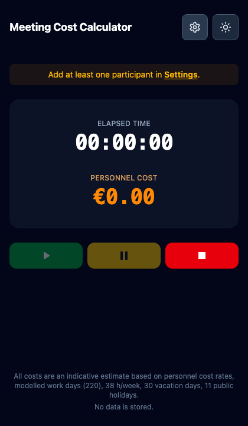
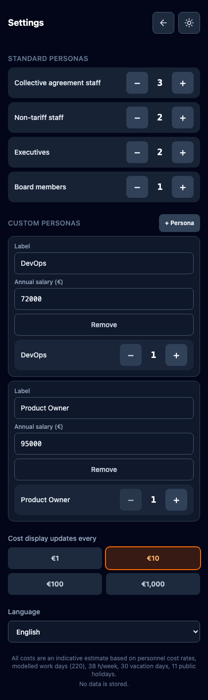
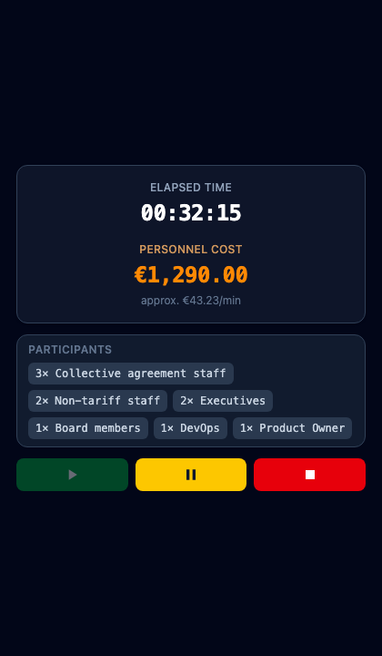

# Meeting Cost Calculator (MCC)

[](LICENSE)
[](.nvmrc)

**Meeting Cost Calculator** is a free, open-source web app that shows the **live personnel cost** of a meeting in real time. It helps teams — especially in **corporations and larger organizations** — build **awareness of how expensive meetings really are**, so people can decide whether a meeting is worth the time and who actually needs to be in the room.

Designed to run **in the corner of your screen** during **in-person meetings, video calls, and workshops** (browser tab, compact window, Picture-in-Picture on supported desktops, or installed PWA).

- **100% free and open source** — [GPL-3.0-or-later](LICENSE)
- **No backend, no database** — nothing is stored on a server; configuration and session state stay in the browser
- **Easy setup** — Docker or [Coolify](https://coolify.io/) in minutes; optional `.env` for salaries and work-time assumptions
- **14 languages** — auto-detected from the browser (DE, EN, ES, IT, PT, FR, HI, ZH, JA, NL, PL, KO, RU, AR); manual override in Settings

---

## Screenshots (English, dark mode)

**Home** — timer ready to start; open Settings to add participants:



**Settings** — participants and options (standard + custom personas):



**Meeting in progress** — 10 participants, 32 minutes elapsed (illustrative display):



---

## Why use it?

Long meetings with many senior participants add up quickly. MCC makes that visible **while the meeting is still running**, not weeks later in a finance report. Typical uses:

- Executive offsites and steering committees  
- Cross-functional syncs with mixed salary bands  
- Training facilitators and agile coaches to pause and ask: *Is this still worth the cost?*  
- A small always-on window next to Zoom, Teams, Meet, or Webex  

At the end of a session, short **reflection prompts** help the group discuss value vs. cost — without storing any personal data.

---

## Features

| Area | What you get |
|------|----------------|
| **Timer** | Start · Pause · Stop (press Stop twice to end and see totals) |
| **Personas** | Standard groups (tariff, non-tariff, executive, board) + custom labels & salaries |
| **Focus mode** | On Start: distraction-free view (timer, participants, controls only); full UI returns after you finish |
| **Mini window** | [Document Picture-in-Picture](https://developer.chrome.com/docs/web-platform/document-picture-in-picture/) on Chrome/Edge desktop; overlay on Safari/iOS and other browsers |
| **Theme** | Light / dark toggle |
| **Cost display** | Rounding step: €1 / €10 / €100 / €1,000 |
| **PWA** | Installable where the browser supports it |
| **Privacy** | No accounts, no analytics database, no meeting data persisted server-side |

---

## Quick start (users)

1. Open your deployed URL (or `npm run dev` locally).
2. Open **Settings** (gear icon), set **language**, participant counts, and optional custom personas.
3. On the **timer** screen, press **Start** (green play).
4. Use **Pause** (yellow) and **Stop** (red) as needed; press **Stop** again to end and review total cost and reflection questions.
5. **New meeting** returns to the full setup view.

**Tip for video calls:** open a small window or use PiP so MCC stays visible in the corner:

```js
window.open(
  'https://your-domain.example/?nopip=1',
  'mcc',
  'width=400,height=520,resizable=yes'
);
```

Add `?compact=1` for a denser layout (`?view=compact` also works).

---

## Configuration

Copy [`.env.example`](.env.example) to `.env` for local builds. In **Docker / Coolify**, set the same variables as **build-time** environment variables (they are embedded into the static bundle as `VITE_*`).

| Variable | Purpose |
|----------|---------|
| `VITE_TIPS_URL` | Link on the end screen (“Tips for more productive meetings”) |
| `VITE_DAYS_PER_YEAR`, `VITE_WEEKEND_DAYS`, `VITE_VACATION_DAYS`, `VITE_PUBLIC_HOLIDAYS` | Work-day model (default → **220** work days/year) |
| `VITE_WORK_DAYS_PER_YEAR` | Optional direct override of work days |
| `VITE_HOURS_PER_WEEK`, `VITE_WORK_DAYS_PER_WEEK` | Hours per week / days per week (default **38 h/week** → 7.6 h/day) |
| `VITE_SALARY_TARIFF`, `VITE_SALARY_NON_TARIFF`, `VITE_SALARY_EXECUTIVE`, `VITE_SALARY_BOARD` | Default annual salaries (EUR) for standard personas |

After changing any `VITE_*` value, **rebuild** the image or run `npm run build` again.

### Cost model (summary)

Per person:

```text
cost per second = annual salary ÷ (work days per year × hours per work day × 3600)
meeting cost     = Σ (participants × rate) × elapsed seconds
```

Displayed running cost uses your chosen **rounding step**; the **final total** uses two decimal places. Figures are **indicative estimates**, not payroll.

---

## Deploy with Docker

**Requirements:** Docker Engine 20+ and Docker Compose v2.

### 1. Clone and configure (optional)

```bash
git clone git@github.com:drhdev/meeting-cost-calculator.git
cd meeting-cost-calculator
cp .env.example .env
# Edit .env — set VITE_TIPS_URL and salaries if needed
```

### 2. Build and run

```bash
docker compose up --build -d
```

The app listens on **port 80 inside the container**, mapped to **`8080` on the host** by default.

| Variable | Default | Description |
|----------|---------|-------------|
| `MCC_PORT` | `8080` | Host port mapped to container port 80 |
| `VITE_*` | see `.env.example` | Passed as Docker **build args** (see `docker-compose.yaml`) |

### 3. Verify

```bash
curl -f http://localhost:8080/
curl -f "http://localhost:8080/?compact=1"
docker compose ps
docker compose logs -f mcc
```

### 4. Stop

```bash
docker compose down
```

### Production notes

- Serve **HTTPS** in front of the container (reverse proxy, Coolify, Traefik, etc.).
- The image is **nginx** serving static files from `dist/`; no Node.js process at runtime.
- Health check: `GET /` must return HTTP 200 (configured in `Dockerfile` and `docker-compose.yaml`).

### Build image without Compose

```bash
docker build \
  --build-arg VITE_TIPS_URL=https://your-site.example/meeting-tips \
  -t meeting-cost-calculator:latest .
docker run --rm -p 8080:80 meeting-cost-calculator:latest
```

---

## Deploy with Coolify

[Coolify](https://coolify.io/) can deploy this repository from Git with Docker Compose and automatic HTTPS.

### 1. Create a new resource

1. Log in to your Coolify instance.  
2. **+ Add** → **New Resource** → **Application** (or equivalent).  
3. Connect your **Git** provider and select the `meeting-cost-calculator` repository.  
4. Choose the branch to deploy (e.g. `main`).

### 2. Build pack

| Setting | Value |
|---------|--------|
| **Build pack** | Docker Compose |
| **Compose file** | `docker-compose.yaml` (repository root) |
| **Service name** | `mcc` (as defined in compose) |

Coolify builds the `mcc` service from the repo `Dockerfile` (multi-stage: Node build → nginx).

### 3. Environment variables

In Coolify, open **Environment Variables** for the application. Add every variable you need from [`.env.example`](.env.example). All `VITE_*` values are consumed at **build time** — trigger a **redeploy / rebuild** after changes.

**Recommended minimum:**

```env
VITE_TIPS_URL=https://your-org.example/meeting-tips
```

**Optional tuning (examples):**

```env
VITE_SALARY_TARIFF=90000
VITE_SALARY_NON_TARIFF=150000
VITE_SALARY_EXECUTIVE=300000
VITE_SALARY_BOARD=3000000
VITE_HOURS_PER_WEEK=38
```

`MCC_PORT` is mainly relevant for local Compose; Coolify maps container port **80** to your public domain automatically.

### 4. Domain & HTTPS

1. **Domains** → add e.g. `mcc.your-company.example`.  
2. Enable **HTTPS** (Let’s Encrypt via Coolify proxy).  
3. Deploy and wait for the build to finish.

### 5. Post-deploy checks

- [ ] `https://mcc.your-company.example/` loads the timer home.  
- [ ] Settings → add participants → Start → focus view appears.  
- [ ] Double Stop → end screen with total cost and reflection.  
- [ ] `https://mcc.your-company.example/?compact=1` works in a small window.  
- [ ] Footer shows your work-day assumptions and “No data is stored.”  

More detail: [`docs/DEPLOYMENT.md`](docs/DEPLOYMENT.md).

---

## Static hosting (without Docker)

```bash
npm ci
cp .env.example .env   # optional
npm run build
# Upload dist/ to any static host (nginx, S3, Netlify, GitHub Pages, …)
# Configure SPA fallback: all routes → index.html
```

---

## Development

**Prerequisites:** Node.js **22** LTS ([`.nvmrc`](.nvmrc))

```bash
npm install
npm run dev              # http://127.0.0.1:5173
npm run lint
npm run typecheck
npm run test
npm run test:e2e
npm run build
npm run verify:production
```

| Script | Description |
|--------|-------------|
| `npm run preview` | Serve production build on port 4173 |
| `npm run icons` | Regenerate PWA icons from `public/icons/icon-source.svg` |
| `npm run test:coverage` | Unit tests with coverage (domain logic) |

**Regenerate README screenshots** (English, dark mode; requires preview on port 4173):

```bash
npm run build && npm run preview -- --port 4173
node scripts/generate-readme-screenshots.mjs
```

---

## Contributing

Contributions, bug reports, and documentation improvements are welcome.

1. **Fork** the repository.  
2. Create a branch for your change.  
3. Run `npm run test:ci` and `npm run test:e2e` before opening a PR.  
4. Open a pull request with a clear description and screenshots if UI changes.

Ideas we’re happy to see: better i18n, accessibility, hosting docs, and responsible use guidelines for enterprises.

**Use it** in your organization, **fork it** to match your salary bands, and **share** improvements back if you can.

---

## Documentation

| Document | Content |
|----------|---------|
| [`docs/DEPLOYMENT.md`](docs/DEPLOYMENT.md) | Deployment checklist |
| [`docs/CROSS_BROWSER_CHECKLIST.md`](docs/CROSS_BROWSER_CHECKLIST.md) | Manual browser matrix |
| [`CHANGELOG.md`](CHANGELOG.md) | Release history |
| [`AGENTS.md`](AGENTS.md) | Notes for AI coding agents |

---

## License

This project is **free software** licensed under the **GNU General Public License v3.0 or later** ([`LICENSE`](LICENSE)).

You may use, study, modify, and redistribute it under the terms of the GPL. If you distribute modified versions, you must also provide source code under the same license.

---

## Disclaimer

All costs shown are **indicative estimates** based on configured personnel cost rates and a simplified work-time model. They are **not** payroll, tax, or legal advice. **No meeting data is stored** in application databases — session state lives only in the browser for that visit.
